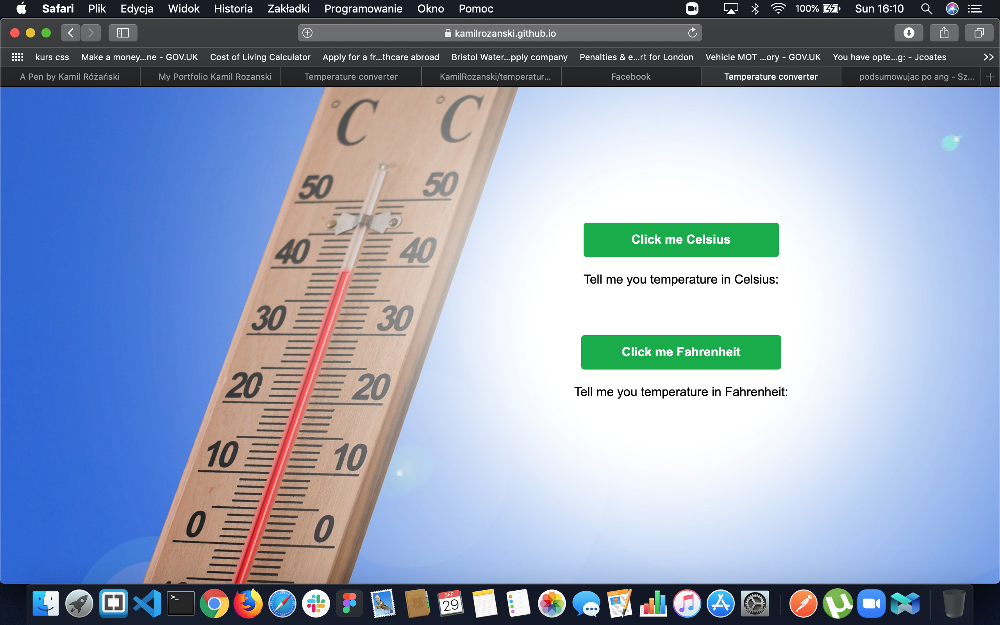

# Temperature-Converter

## This simple program is able to calculate temperature in celsius to fahrenheit and fahrenheit to celsius.

### Tools & technology, with I've used.

- Semantic HTML 💥
- CSS💥
- SASS 💥 💥
- Java Script💥💥
- Gulp/NPM 💥

Programing is my passions, and every day I lear new skills.

